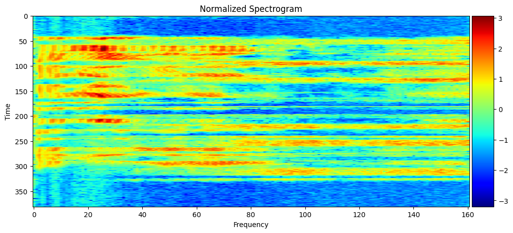
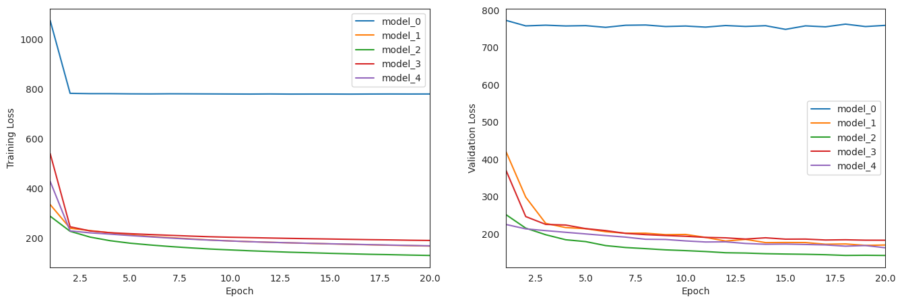
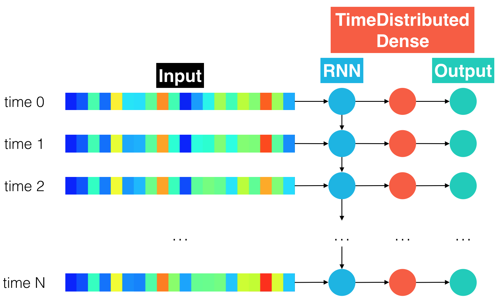

# NLP - Deep Neural Network Speech Recognizer

This notebook demonstrates the process of developing a Deep Neural Network (DNN) model for speech recognition using Natural Language Processing (NLP) techniques. Below is a step-by-step explanation of the workflow presented in the notebook.

## Prerequisites

Before running the notebook, ensure that you have set up your environment correctly. The recommended setup is as follows:

1. **Python Version**: 3.10.14
2. **Conda Environment**: Create a conda environment with the necessary dependencies. You can create and activate this environment using the following commands:

   ```bash
   conda create -n speech_recognizer python=3.10.14
   conda activate speech_recognizer
   ```

3. **Install Required Libraries**: Install all necessary Python libraries within the conda environment. If the notebook contains a `requirements.txt` or a list of dependencies, you can install them with:

   ```bash
   pip install -r requirements.txt
   ```

   If not, manually install the required libraries as you proceed through the notebook.

## Notebook Flow

### 1. **Introduction and Setup**

   - The notebook begins with an introduction to the project, outlining the goals and objectives of the speech recognizer model.
   - It also provides an overview of the libraries and tools used throughout the notebook.

### 2. **Data Loading and Preprocessing**

   - This section covers the process of loading the speech dataset.
   - The data is then preprocessed, including steps like noise reduction, feature extraction, and data augmentation. These steps are crucial for improving the model's performance.
   - The normalized spectrogram of the speech data is visualized to give an overview of the audio features extracted. You can see this in the image below:

     

### 3. **Feature Extraction**

   - The notebook demonstrates how to extract relevant features from the audio data. Typically, this involves converting the audio signals into Mel-Frequency Cepstral Coefficients (MFCCs) or other relevant features.
   - The extracted features are normalized and prepared for input into the neural network.

### 4. **Model Architecture and Pipeline**

   - This section defines the architecture of the Deep Neural Network (DNN). The model layers are constructed, which may include Convolutional Neural Networks (CNNs), Recurrent Neural Networks (RNNs), or fully connected layers.
   - The notebook explains the reasoning behind the chosen architecture and the activation functions used.
   - The pipeline for all models is illustrated in the image below, providing a visual summary of the steps taken from raw audio input to final prediction:

     

### 5. **Model Training**

   - The prepared data is split into training and validation sets.
   - The notebook details the training process, including the choice of optimizer, loss function, and evaluation metrics.
   - It also includes techniques like early stopping and learning rate scheduling to enhance model performance.

### 6. **Model Comparison**

   - The notebook compares the performance of different models (Model_0 to Model_4) trained with varying architectures and hyperparameters.
   - The comparison plot showcases the accuracy and loss metrics across these models, helping identify the best-performing model:

     

### 7. **Model Evaluation**

   - After training, the model is evaluated on the validation set.
   - Performance metrics such as accuracy, precision, recall, and F1-score are calculated and discussed.
   - The notebook might also include visualizations of the model's performance, such as confusion matrices or loss curves.

### 8. **Model Testing**

   - This section involves testing the model on a separate test set or real-world data to assess its generalization capability.
   - The notebook may provide examples of how the model performs on unseen data, highlighting strengths and potential areas for improvement.


### Notes
- model_0 ( Simple RNN )


- model_1 ( RNN + BatchNorm )


- model_2 ( CNN + RNN )


- model_3 ( Deep RNN )


- model_4 ( Bidirectional RNN )


- model_end ( Hybrid )

**Built based on the insights from previous architectures.**